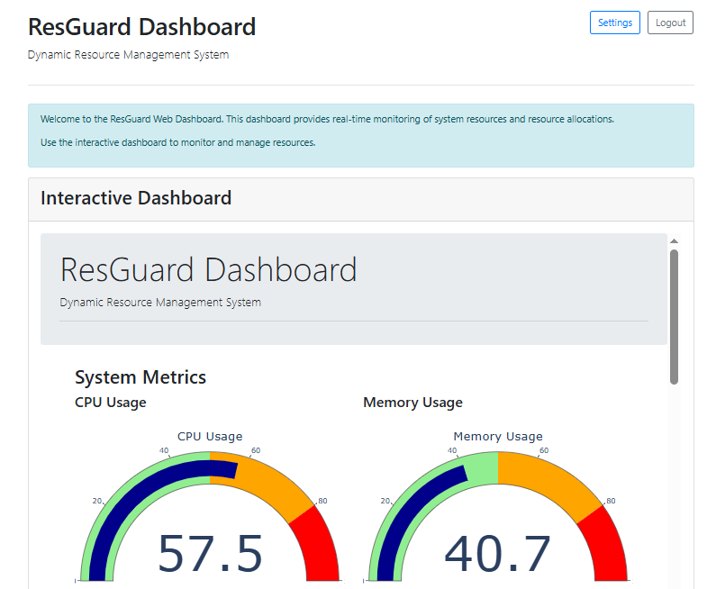

# ResGuard: Dynamic Resource Management System

[](https://opensource.org/licenses/MIT)
[](https://www.python.org/downloads/)

A software project to dynamically allocate computing resources (e.g., memory, CPU, storage) using the Banker's Algorithm to prevent deadlocks, optimize utilization, and provide real-time monitoring.



## Project Overview

**Motivation**: Resource competition in computing causes bottlenecks and deadlocks, contributing to ~25% of system slowdowns (TechSys Reports, 2024). ResGuard ensures efficient resource allocation, prevents deadlocks, and enhances system reliability.

**Objectives**:
1. Prevent deadlocks while maximizing resource use (up to 90% utilization)
2. Offer a real-time dashboard for system monitoring
3. Adapt to workload changes automatically
4. Validate performance through testing

## System Components

- **Core Manager**: Implements Banker's Algorithm for safe resource allocation
- **Desktop App**: Tkinter-based UI for resource management
- **Web Dashboard**: Flask/Dash/Plotly for real-time visualization
- **Alerting System**: Monitors resource usage and generates alerts when thresholds are exceeded

## Key Features

- **Deadlock Prevention**: Uses a modified Banker's Algorithm that allows up to 90% resource utilization
- **Real-time Monitoring**: Desktop and web interfaces for monitoring resource usage
- **Resource Reset**: Automatically resets allocations to 0 on startup for a clean slate
- **State Persistence**: Saves and loads system state between runs
- **Interactive Dashboards**: Real-time charts and visualizations of resource usage
- **Alerting System**: Generates alerts when resource usage exceeds configurable thresholds
- **Configurable**: Basic configuration options via settings UI and command-line arguments

## Installation

### Prerequisites

- Python 3.7 or higher
- pip (Python package manager)

### Setup

```bash
# Clone the repository
git clone : https://github.com/lakshyakumar90/Resguard--Resource-Management-System.git
cd resguard

# Install dependencies
pip install -r requirements.txt

# Create a configuration file
cp config.json.example config.json

# Run the application
python main.py
```

## Usage

### Basic Usage

```bash
# Run with default settings (resets resources and allocations)
python main.py

# Run with debug output
python main.py --debug

# Run without resetting allocations
python main.py --keep-allocations

# Run web dashboard only
python main.py --web-only

# Run desktop application only
python main.py --desktop-only
```

### Desktop Application

1. Start the application using `python main.py`
2. Log in to the desktop application (default: admin/admin)
3. Request resources through the UI by entering process ID and resource amounts
4. Monitor resource usage in real-time
5. Use the Tools menu to reset resources or access settings

### Web Dashboard

1. Access the web dashboard at http://localhost:5000
2. Log in with the same credentials as the desktop app
3. View real-time resource usage charts
4. Request and release resources through the web interface
5. Access settings to configure the system

## Configuration

ResGuard can be configured through the `config.json` file or via the settings UI:

- **System**: State directory, save intervals, history size
- **Resources**: Available CPU, memory, disk, and network resources
- **Desktop App**: Window title, size, and refresh interval
- **Web Dashboard**: Host, port, debug mode, and refresh interval
- **Security**: Authentication settings
- **Logging**: Log level, file, size, and backup count
- **Alerting**: Warning and critical thresholds, cooldown periods

## Architecture

ResGuard follows a modular architecture:

```
resguard/
├── core/               # Core logic
│   ├── banker_algorithm.py     # Banker's Algorithm implementation
│   ├── resource_manager.py     # Central resource management
│   ├── thread_manager.py       # Concurrent task handling
│   ├── state_manager.py        # State persistence
│   └── alerting_system.py      # Alerting system
├── desktop_app/        # Desktop UI
│   ├── app.py                  # Main application
│   ├── dashboard.py            # Resource monitoring UI
│   └── settings_dialog.py      # Settings UI
├── web_dashboard/      # Web UI
│   ├── app.py                  # Flask application
│   ├── dashboard.py            # Dash/Plotly dashboard
│   └── templates/              # HTML templates
├── utils/              # Utilities
│   ├── system_monitor.py       # System monitoring
│   └── config.py               # Configuration management
└── tests/              # Unit tests
```

## Development

### Running Tests

```bash
# Run all tests
python -m unittest discover tests

# Run specific test
python -m unittest tests.test_banker
```

### Contributing

1. Fork the repository
2. Create a feature branch: `git checkout -b feature-name`
3. Commit your changes: `git commit -am 'Add some feature'`
4. Push to the branch: `git push origin feature-name`
5. Submit a pull request

## License

This project is licensed under the MIT License - see the [LICENSE](LICENSE) file for details.

## Contributors

- Lakshya Kumar (Team Leader)
- Chitrance Dogra
- Aman Rana
- Anshuman Riar

## Acknowledgments

- The Banker's Algorithm was developed by Edsger Dijkstra
- Thanks to all contributors who have helped shape this project
